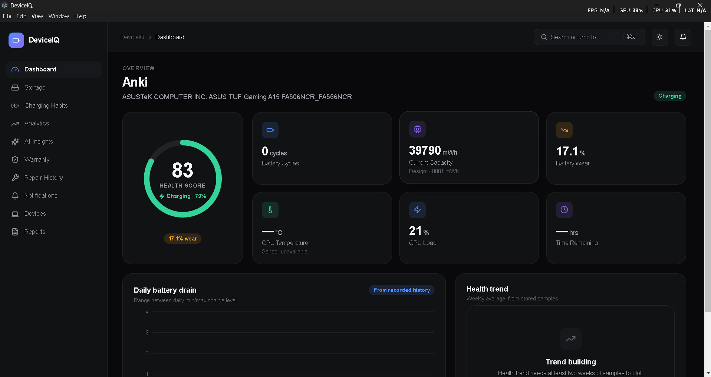
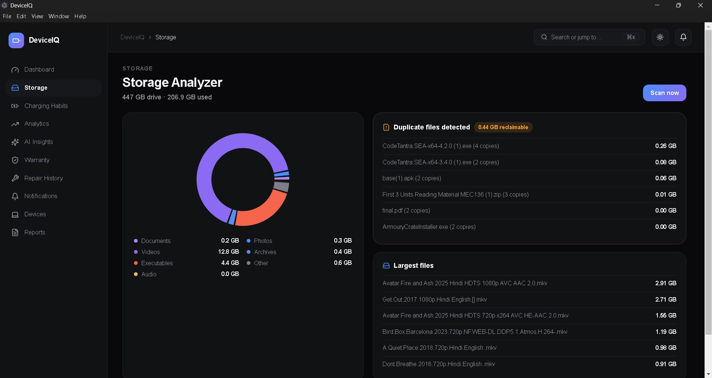
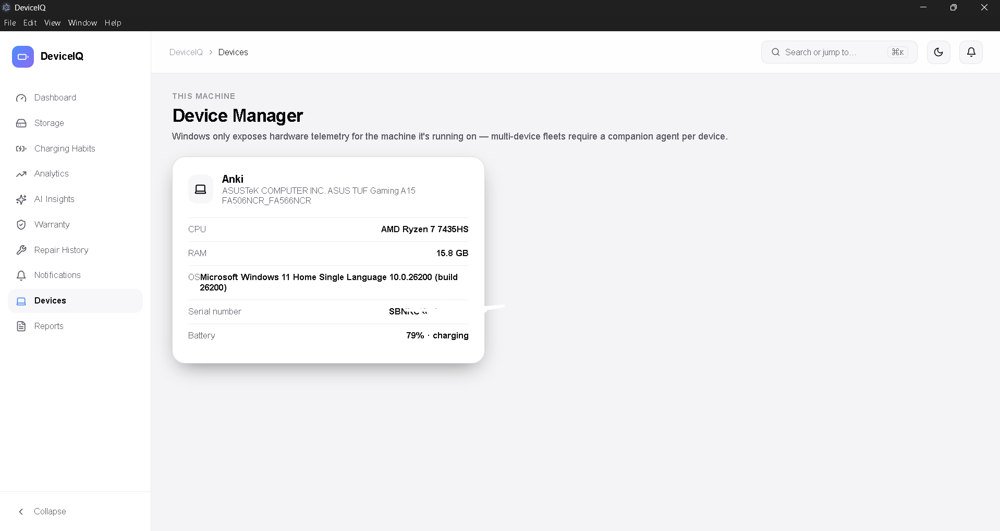
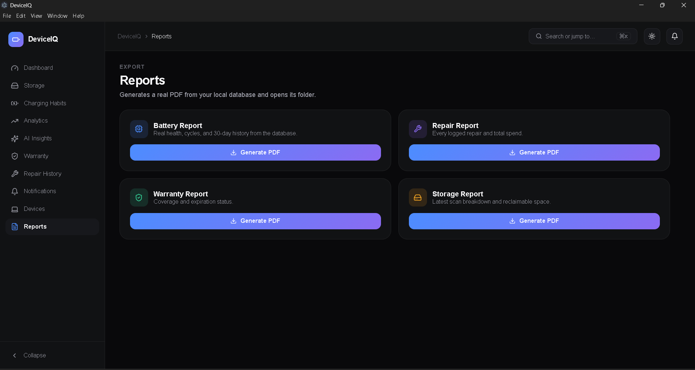

<div align="center">

# 🚀 DeviceIQ

### AI-Powered Windows Desktop Application for Real-Time Device Health Monitoring

Monitor your battery health, CPU, RAM, storage, charging habits, warranty, repairs, notifications, and AI-powered device insights—all from one modern desktop application.


</div>

---

# 📖 Overview

DeviceIQ is an AI-powered Windows desktop application built using **Electron**, **React**, **Node.js**, and **SQLite**.

It provides real-time monitoring and analytics of your Windows device, including battery health, charging behavior, CPU usage, memory usage, storage analysis, warranty tracking, repair history, AI-powered recommendations, and detailed reports.

---

# ✨ Features

## 🔋 Battery Monitoring

- Live Battery Percentage
- Battery Health
- Charging Status
- Charging Analytics
- Charging History

## 🖥️ System Monitoring

- Live CPU Usage
- CPU Temperature
- RAM Usage
- Storage Usage

## 🤖 AI Features

- AI Device Insights
- Smart Recommendations
- Battery Usage Analysis
- Charging Habit Detection

## 📊 Analytics

- Interactive Dashboard
- Historical Data
- Battery Trends
- Device Statistics

## 💽 Storage Analysis

- Storage Utilization
- Folder Size Analysis
- Large File Detection
- Duplicate File Detection

## 🛡️ Device Management

- Warranty Tracking
- Repair History
- Smart Notifications
- PDF Report Generation

---

# 📸 Screenshots

<p align="center">





</p>

<p align="center">




</p>

<p align="center">



</p>

---


Example:

https://github.com/user-attachments/assets/your-video

---

# 🛠 Tech Stack

| Technology | Purpose |
|------------|---------|
| Electron.js | Desktop Application |
| React.js | User Interface |
| Node.js | Backend |
| SQLite | Local Database |
| systeminformation | Hardware Monitoring |
| PDFKit | PDF Reports |

---

# 📂 Project Structure

```text
DeviceIQ
│
├── electron
│   ├── db
│   ├── ipc
│   ├── services
│   ├── preload.js
│   └── main.js
│
├── src
│   ├── components
│   ├── hooks
│   ├── renderer
│   └── views
│
├── screenshots
├── package.json
└── README.md
```

---

# 🚀 Installation

Clone the repository

```bash
git clone https://github.com/Ankitsingh-1122/DeviceIQ.git
```

Move into the project

```bash
cd DeviceIQ
```

Install dependencies

```bash
npm install
```

Run

```bash
npm run dev
```

Build

```bash
npm run build
```

---

# 💡 What I Learned

- Electron Desktop Development
- React State Management
- Electron IPC
- SQLite Database Integration
- Hardware Monitoring
- File System Operations
- AI-based Device Analytics

---

# 🔮 Future Improvements

- GPU Monitoring
- Network Monitoring
- SMART Disk Health
- Auto Updates
- Cloud Backup
- Cross-Platform Support
- Mobile Companion Application

---

# 🤝 Contributing

Contributions, feature requests, and suggestions are welcome.

If you like this project, don't forget to ⭐ the repository.

---

# 👨‍💻 Developer

### Ankit Kumar Singh

**B.Tech CSE (AI & ML)**

Connect with me on LinkedIn and feel free to explore the project.

---

# 📄 License

This project is licensed under the MIT License.